# Project Map

A non-authoritative conceptual view of the MILSTRIP intake automation
project. [`project-map.json`](project-map.json) is the canonical source for
current paths, purposes, and hierarchy. [`PROJECT_MAP.html`](PROJECT_MAP.html)
is a viewer for that JSON, not another data source.

## The big picture

```mermaid
graph TD
    ENTRY["README.md / run_milstrip.bat"] --> PKG["milstrip/<br/>Phase 1 Python package"]
    API["api/<br/>local Windows API"] --> DB["db/migrations/<br/>milstrip_app schema"]
    API --> PKG

    PKG --> EXTRACT["intake/extractor.py<br/>HTML/whitespace cleanup, candidate detection"]
    PKG --> PARSE["parsing/parser.py<br/>lossless family-aware extraction"]
    PKG --> NORM["parsing/normalizer.py<br/>deterministic transport normalization"]
    PKG --> VALID["validation/structural.py<br/>point validators, no database"]
    PKG --> BUILD["canonical/builder.py<br/>rebuild 80-char record"]
    PKG --> CLI["cli.py<br/>text / diagnostic JSON, always dry-run"]

    DOCS["docs/<br/>this project's design docs"] --> MASTER["master.md<br/>status, scope, governance profile"]
    DOCS --> SPEC["MILSTRIP_SPEC.md<br/>field-by-field evidence"]
    DOCS --> ARCH["ARCHITECTURE.md<br/>boundary + diagrams"]
    DOCS --> ROADMAP["ROADMAP.md<br/>Phase 1 accepted; future phases gated"]
    DOCS --> EVIDREG["DISCOVERY_EVIDENCE.md<br/>source-to-claim register"]
    DOCS --> SOP["USER_SOP.md<br/>English operator procedure"]
    DOCS --> RAINBOW["RAINBOW_INTERFACE_CONTRACT.md<br/>Phase 2 CSV / transfer contract"]
    DOCS --> OPEN["OPEN_QUESTIONS.md"]

    EVIDENCE["local-discovery/<br/>local-only raw evidence, Git-ignored"] -.->|derived into| SPEC

    classDef entry fill:#2b6cb0,color:#fff,stroke:#2b6cb0
    classDef core fill:#2f855a,color:#fff,stroke:#2f855a
    classDef docs fill:#6b46c1,color:#fff,stroke:#6b46c1
    classDef integration fill:#c05621,color:#fff,stroke:#c05621
    class ENTRY entry
    class PKG core
    class API,DB integration
    class DOCS,MASTER,SPEC,ARCH,ROADMAP,OPEN docs
```

## Reading it

- **Blue** = where you start. **Green** = the Phase 1 package itself — a
  straight-line pipeline (extract → parse → normalize → validate → build),
  each stage a small, independently testable module. **Purple** = the design
  documentation this project maintains about itself.
- `milstrip/domain.py` (not drawn separately above — it underlies every green
  node) is the single source of truth for MILSTRIP field positions; the
  parser derives from it; the builder preserves the validated normalized
  source byte-for-byte and only right-pads to 80.
- `tests/` (not drawn) exercises every module above against real MILSTRIP
  sanitized examples derived from the local-only SQL prototype.
- `api/` is the local Windows API boundary. It persists received requests only
  through the application-owned `milstrip_app` schema in `db/migrations/`; it
  does not write to legacy operational tables. The parser is not connected
  until the missing source package is restored.

## What's not on this diagram

The existing, unmodified downstream pipeline (`staging_download_shipMILS` →
`download_ship940` → ADF → `ShipMaster` → Boomi → SCALE) — see
`docs/ARCHITECTURE.md` for that diagram specifically; it belongs to the
legacy 3PL platform, not to this project. File-level detail beyond what's
above lives in `project-map.json`, not here.
