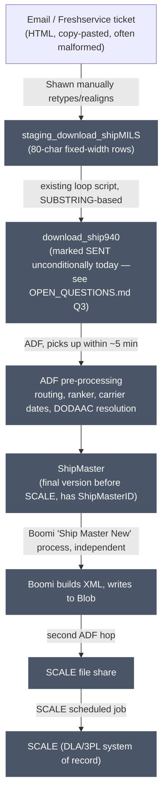
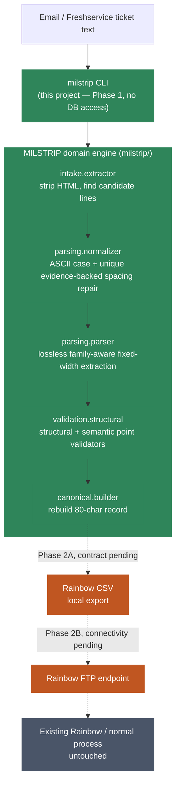
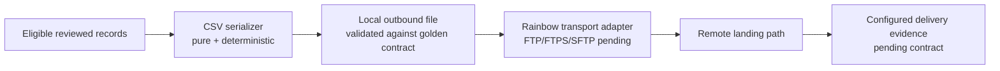
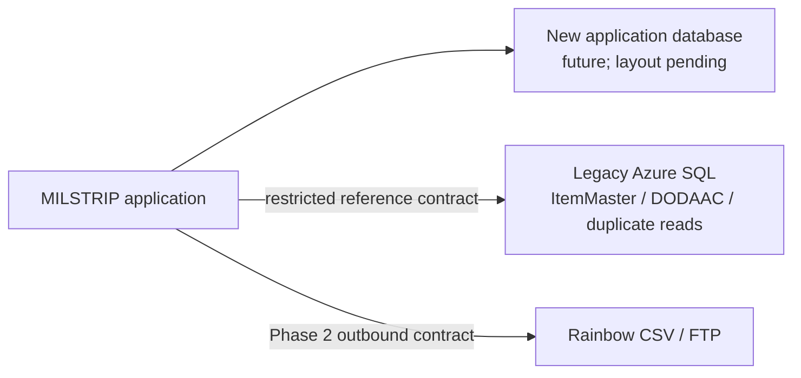

# Architecture

## Current state (unchanged by this project)

Reconstructed from the 2026-08-12 discovery calls with Shawn Hinkle and the
prototype SQL. Everything in this section already works today and this
project does not modify any of it.

Everything from `staging_download_shipMILS` onward (grey) is stable,
production-proven, and explicitly out of scope — Shawn: *"if that is working,
we shouldn't be changing that."* Ed, same call: *"I want to keep whatever is
working and work from there."*

## Target boundary

**Phase 1 responsibility ends at a validated canonical 80-character record
and a human-readable / diagnostic JSON report.** Phase 2 extends the boundary
to creating the exact Rainbow CSV and transferring it to Rainbow's FTP
endpoint. The agreed remote acknowledgement—not a local file write—will define
successful delivery. Everything after that handoff remains the existing
process and is untouched. See ADR 0003.

## Phase 2 outbound boundary — contract-first and replaceable

The CSV serializer owns formatting only. The transport adapter owns network
transfer only. The launcher coordinates them and reports local creation and
remote delivery as separate outcomes. The transfer protocol is deliberately
not fixed in code until the vendor confirms FTP versus FTPS/SFTP. Credentials
and endpoints are environment configuration, never source files. Uploads must
use an agreed atomic convention if Rainbow supports it.

## Future application database — Phase 3; layout deliberately deferred

The design brief that originated this project (see `AEKR Full Design Master
Prompt — MILSTRIP Automation - Lean Audit Version.md`) asks for an early
ADR comparing a new Azure SQL database, a new PostgreSQL database, extracted
legacy objects, or no new database at all (Options A-D in that document).

The owner has decided that Phase 3 will use a separate application-owned
database; see ADR 0002. Phases 1 and 2 must not assume its schema. Technology,
schema and connectivity remain deferred until the owner supplies the table
layout. The new database owns only intake, validation, processing state,
submission attempts and traceability; it does not clone the legacy WMS.

Required connection posture: separate environment-specific identities,
least-privilege read and submit paths, encrypted connections, secrets outside
source control, timeouts, idempotency and structured results. No table contract
is invented before the supplied layout is reviewed.

## Legacy integration boundary (for Phase 3 planning — not built yet)

Classified per the design brief's own vocabulary, based on the diagnostic
report (local-only `local-discovery/Initial Idea/informe_trav3pl_sqldb.md`) and
the SQL prototype:

| Object | Classification | Notes |
|---|---|---|
| `staging_download_shipMILS` | EXISTING DOWNSTREAM INTERNAL | No direct application write is planned under ADR 0003. |
| `download_ship940` | DOWNSTREAM INTERNAL | Existing script's target; this project never writes here directly. |
| `ItemMaster` | POSSIBLE READ REFERENCE (Phase 3) | Exact approved reference contract remains pending. |
| `cfg_dodaac_active` / `cfg_dodaac` | POSSIBLE READ REFERENCE (Phase 3) | Exact approved reference contract remains pending. |
| `ShipMaster`, `ShipOrders`, `ShipShipments`, inventory/billing/carrier tables | NOT REQUIRED | Owned entirely by the existing pipeline; this project has no reason to touch them. |

## Explicitly out of scope

Boomi, ADF, SCALE, the legacy database's performance issues documented in
the local-only database report (stale statistics, missing indexes,
wide tables), inventory, billing, receiving, and carrier processing. This
project's diagnostic-report evidence is cited only where it affects a design
decision (e.g. picking a low-impact read pattern for Phase 2), never as a
mandate to fix the legacy database.
