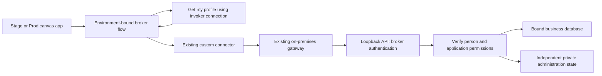

# ADR 0006 - Verified user access and administration through a flow broker

**Date:** September 24, 2026

**Status:** Implemented in source; native deployment and acceptance pending

## Context

Power Apps licensing is resolved in both published players. Stage is healthy
and retained results were read; Prod reports an unavailable, disabled database.
The owner requests database
configuration and user administration inside the existing Stage and Prod apps.
API 0.4.0 currently identifies a shared Basic account, not the person using the
app. Its native host configuration screen does not meet the new interface
requirement. Existing solution, app IDs, custom connector and gateway remain.

Application access is restricted to approved members of the organization's
`austinlighthouse.org` directory. Claude Furry
(`claude.furry@austinlighthouse.org`) and Mike Thompson
(`mike.thompson@austinlighthouse.org`) are permanent application owners. Ed,
Kristen, Thomas and Shawn are application administrators. Mike's owner role takes
precedence over his duplicate administrator entry. A live tenant directory probe
verified all six as enabled internal members; their immutable identities are
retained privately. Names and addresses are not authentication.

## Decision

Use one controlled Power Apps-triggered broker flow for each app environment:

The flow obtains its caller through Office 365 Users **Get my profile (V2)**,
with that connection configured **Provided by run-only user**. The API call uses
a separate, unshared flow-owned Basic credential bound to Stage or Prod. The
flow constructs identity fields itself; canvas inputs contain only the requested
operation and its data. Microsoft documents invoker-owned connections and the
profile operation. This composition must be tested in the tenant before release.
[Run-only connections](https://learn.microsoft.com/en-us/power-automate/create-team-flows),
[Office 365 Users](https://learn.microsoft.com/en-us/connectors/office365users/)

The API authenticates the broker, selects its fixed environment, and evaluates
the verified person's current application permissions on **every business and
administration operation**. An allowlisted operation dispatcher calls typed
services; it cannot forward arbitrary URLs, HTTP methods, SQL or shell commands.
After cutover, direct calls using the old canvas-shared Basic credentials cannot
read business data, submit intake, review records or administer the application.

The broker is a trusted identity intermediary. It does not deliver an Entra access
token to the local API. Its owners and connection custodians are trusted platform
maintainers. Ordinary app users, including in-app administrators, receive only
app **CanView** and flow **run-only** permissions. Application Owner is distinct
from Power Platform app owner, Environment Maker and flow co-owner.

## Identity and roles

Use the fixed tenant ID and immutable directory object ID as the principal key.
Resolve onboarding candidates against a trusted connection to the expected
tenant, require an enabled internal member and the approved corporate domain,
then store the resolved object ID. Reject guests, unknown IDs and inactive
members. Never create an ACL entry merely because a caller supplies an email
ending in the allowed domain. Microsoft's identity guidance distinguishes stable
authorization identifiers from mutable UPN/email claims.
[Claims validation](https://learn.microsoft.com/en-us/entra/identity-platform/claims-validation)

| Application role | Business operations | Manage users | Configure runtime |
|---|---|---|---|
| Owner | Yes | Yes | Yes |
| Admin | Yes | Yes | Yes |
| Operator | Yes | No | No |
| Inactive or unknown | No | No | No |

The two permanent owner object IDs cannot be removed, disabled or demoted by
application operations, including by another owner. Owner is not an assignable
role in the user editor. Directory disablement still blocks application access. Admins may
manage other Admin and Operator memberships; no directory-account creation,
password reset or tenant-role administration is introduced.

Do not use `User().Email`, `User().EntraObjectId`, a passed role, or raw
`x-ms-user-*` headers as proof of identity. These canvas properties can still
support display and diagnostics. [Power Fx User](https://learn.microsoft.com/en-us/power-platform/power-fx/reference/function-user)

Use the organization's existing Entra sign-in. Tenant realm discovery on
September 24 returned `Managed` for `austinlighthouse.org`; the current path is
managed Entra SSO. No AD FS installation or federation change is part of this
implementation.

## User sharing and recovery

Store desired membership and platform-sharing status separately. A controlled
flow-owned management connection reconciles individual **CanView** grants on
the fixed Stage/Prod app IDs and run-only grants on the fixed broker flow IDs.
Start with the six approved people; do not share with Everyone or an entire
tenant. A future security group must be explicitly identified and approved.

Power Apps for Makers supplies **Get App Role Assignments** and **Edit App Role
Assignment**. Power Automate Management supplies **List Flow Run-Only Users**
and **Modify Run-Only Users**. These connections stay inside controlled flows;
app users do not receive their platform rights. September 24 tenant connector
metadata confirmed the edit/delete payloads and `DoNotNotify` setting.
Notifications are off: the documented notification field is a string, and `Notify` requests mail;
do not invent a Boolean `sendEmail` parameter.
[Makers connector](https://learn.microsoft.com/en-us/connectors/powerappsforappmakers/),
[Flow management connector](https://learn.microsoft.com/en-us/connectors/flowmanagement/),
[Notification parameter](https://learn.microsoft.com/en-us/connectors/powerappsforadmins/#edit-app-role-assignment-as-admin)

On removal, revoke API authorization first, then remove platform grants. On
addition, keep access pending until app and flow permissions are read back.
Record partial failures and allow retry of the same change. Never claim a user
was fully added or removed merely because the local ACL save succeeded.

A server lease serializes external sharing changes per target across Stage and
Prod. No lease expires into a second writer while an earlier external write has
an unknown outcome. A newer removal denies API access immediately and waits for
the older execution before changing platform grants. The one verified deployment
owner's existing Owner grant counts as app view access; other users require
CanView. Removing that deployment owner can leave platform cleanup pending until
IT transfers ownership. The application cannot transfer platform ownership.

The shared Management connection permits five calls per 60 seconds. Before each
call, either flow must obtain the same durable server permit and wait until its
issued time. A confirmed completion starts a 13-second cooldown. Unknown calls
retain the permit; no expiry permits another caller to overlap them. This also
prevents delayed flow actions from bunching previously reserved future slots.
Native pacing and timeout recovery remain acceptance requirements.

## Database configuration

Keep the administration state independent of both business databases in one
private `.cred/control.json`: ACL, pinned owners, active profile revisions,
drafts, test receipts, operation results and sanitized audit events. Use the
existing file lock, revision checks and atomic replacement. Import the old
runtime configuration once; do not maintain two competing active stores.

Configuration and user administration require verified identity and capability,
not a healthy business database. The Prod app must allow authorized configuration
while Prod is disabled. Show sanitized targets and masked replacement inputs;
never return stored credentials. Protect every flow trigger/action that carries
secrets with secure inputs/outputs and inspect run history during acceptance.
[Sensitive inputs](https://learn.microsoft.com/en-us/power-automate/how-tos-use-sensitive-input)

Save and Test do not activate or provision. Apply requires a fresh server-issued
test receipt matching the exact draft and active revision, rechecks permission,
drains requests for the affected profile, and changes its durable active
revision atomically. Requests cannot move databases midway through a transaction.
Preserve provider validation, Stage/Prod identity checks and existing rows.
Schema provisioning and historical-data migration remain separate operations.
Changing the normalized database target requires disabling that profile first;
the other profile remains available. Disabling drains the affected profile and
does not require a successful test of an unavailable database. After migration
and reconciliation, a fresh test can authorize activation of the new target.
There is no automatic fallback to another database.

Run one API worker. The control service is the sole writer while it is serving;
native tools cannot alter the active file behind its in-memory registry. A crash
before the durable activation commit retains the old revision; a restart after
that commit loads the new one.

## Alternatives and limits

Direct delegated Entra OAuth is a viable future API boundary, but needs approved
API exposure, registrations, token validation and verified connectivity. Current
primary documentation does not establish OAuth availability for this exact
gateway-enabled connector configuration; this decision does not depend on it.
[Entra custom connectors](https://learn.microsoft.com/en-us/connectors/custom-connectors/azure-active-directory-authentication)

Hiding admin controls or forwarding an email through shared Basic authentication
does not meet the requirement. The broker, directory lookup, sharing operations
and fail-closed cutover must all pass acceptance. Neither this ADR nor publication
establishes live Azure SQL acceptance, Prod database readiness or downstream
shipment delivery.

Implementation handoff: [contract and task list](../delivery/IDENTITY_ADMIN_IMPLEMENTATION_CONTRACT_2026-09-24.md).
Current observations and remaining work: [delivery status](../delivery/IDENTITY_ADMIN_STATUS_2026-09-24.md).

## September 25 extension (local source)

Database provider selection defaults to automatic detection from a validated
connection string. InitializeRuntimeDraft is an explicit admin-only command in
the existing Power Apps Configuration screen. It requires a disabled environment,
a saved draft, exact target confirmation and active broker-only administration.
It creates/updates application schema version 2 while preserving existing data;
Save/Test/Apply retain their previous separation. Historical data migration is
still a prerequisite to changing engines, not a side effect of a connection string.

GetIntakeWorkflow and CreateIntakeRequest enforce one unfinished intake per verified
operator, with final decisions on every record. A database transaction serializes
submission checks through the environment identity row. Normalized fingerprints
block repeats across operators in that environment for two hours. A verified
Admin/Owner may supply an explicit reason to override only the duplicate check;
the actor, reason and matching intake are recorded in the database audit.
