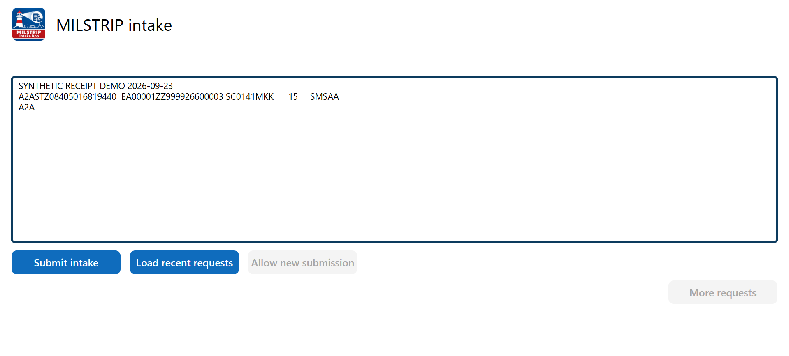
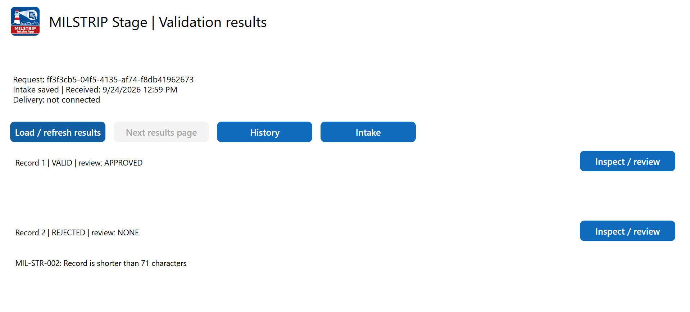
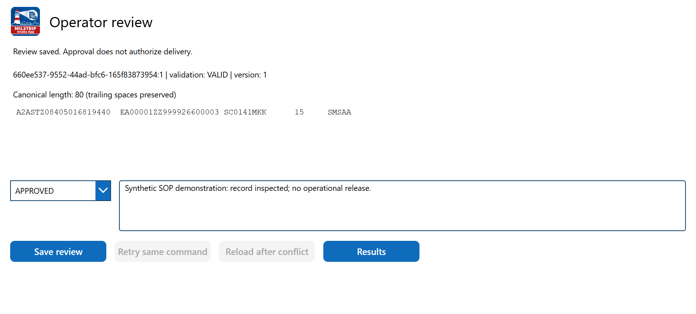
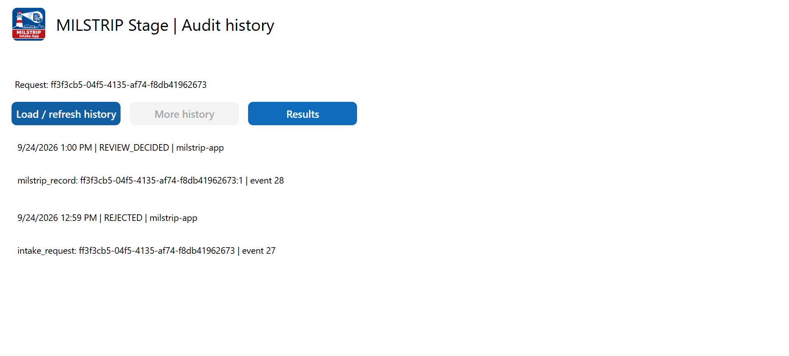
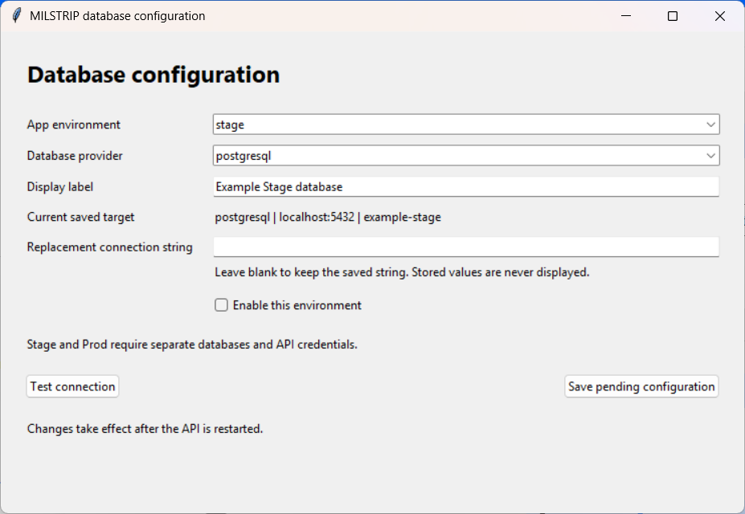

**Status — September 25, 2026:** Stage **16** and Prod **6** are published for **limited acceptance**. Six memberships and broker-only enforcement are active. Player checks and licensing are verified for the current administrator only. Second-user, role, intake-submission recovery and diagnostic/accessibility checks remain pending. Prod's database stays disabled.

## Use the app

Use **MILSTRIP Stage** for approved testing. Select **Check connection**; confirm **STAGE** and **Ready**. Review approval does not deliver an order.

<ol class="steps" start="1">
<li><h3>Enter the source</h3>
Paste the original email or ticket text. Obtain missing values from its owner. Resume an unfinished intake before entering another.
</li>
<li><h3>Submit the intake</h3>
Select <strong>Submit intake</strong> once. Confirm <strong>Intake saved</strong> and the <strong>Request ID</strong>; retain that ID. Follow submission recovery below if confirmation is missing.
</li>
</ol>

<ol class="steps" start="3">
<li><h3>Inspect the results</h3>
Select <strong>Load / refresh results</strong>, then <strong>Review record [number]</strong> for each record. Read its issues; use <strong>Next results page</strong> when enabled. Canonical records are read-only.
</li>
</ol>

<ol class="steps" start="4">
<li><h3>Record your decision</h3>
Choose <strong>APPROVED</strong> or <strong>REJECTED</strong>, enter a reason of 1–1,000 characters, and select <strong>Save review</strong>. Validation-REJECTED records cannot be approved. Resolve warnings against business evidence.
</li>
<li><h3>Verify every saved review</h3>
Check the saved message and updated version. Return to <strong>Results</strong> and refresh. Every record, including invalid records, needs a final decision before another intake.
</li>
</ol>

<ol class="steps" start="6">
<li><h3>Verify history and continue</h3>
Select <strong>History → Load / refresh history</strong>. Find <strong>REVIEW_DECIDED</strong> and the authenticated human actor. Return to <strong>Intake → Resume / new intake</strong>; a completed flow clears the form.
</li>
</ol>

### Recovery procedures

Submission has no confirmation

Keep the text and displayed **source ID**. Select **Resume / new intake** to reconcile that ID. One matching saved receipt opens Results. An unconfirmed or ambiguous result stays blocked; check again or contact an administrator. Do not submit a replacement blindly.

Corrected source or duplicate content

Finish every record's review before submitting corrected source; retain both Request IDs. Identical normalized content is blocked across users for two hours. Admins/Owners may select **Override 2-hour duplicate block** and enter the required audited reason. Override does not bypass unfinished reviews.

Review is unconfirmed or conflicts

For an unknown outcome, select **Retry same command** with the retained decision and reason. Native review retry passed. For a conflict, select **Reload after conflict**, inspect the current version, then decide whether another review is needed.

Service is unavailable or the app restarted

Contact support with environment, Request ID, record number, time and error. Closing loses unsaved input and session commands. Reconcile requests and history after recovery before resubmitting.

Operator flowchart

## Understand the workflow

Canonical records contain 80 characters. Production item/address lookups and delivery remain outside this app.

| Confirmation | Evidence | Availability |
|---|---|---|
| Intake saved | Stored source, validation and Request ID | Implemented |
| Review saved | Decision, reason, version and human audit actor | Implemented |
| Handoff / downstream receipt | Destination acceptance / receiver acknowledgement | Proposed |

Functional flow

Architecture and acceptance limits

Both broker bindings are verified; one API worker enforces access. Prod's initial startup stalled after connection consent; one read-only browser reload recovered it. The cause is unproven.

## Administrator: database configuration

Configuration — Admins and Owners

Open **Configuration → Load configuration** in the intended app. Keep provider **auto**; a blank replacement string retains the saved connection. Saved credentials are never displayed.

Select **Save draft**, then **Test draft**. A **PASSED** test of that exact draft permits **Apply draft** within five minutes. Confirm **APPLIED**, then check the connection again. **Discard draft** unlocks editing.

Disable the environment before changing its destination. For initialization, save a draft and confirm its exact displayed target; **Initialize database** requires a disabled environment. It prepares application objects, not a new database service. Migrating history remains separate from changing the string.

An unknown result retains its command: use **Check command status**, then **Retry same command** if necessary. Native Save/Test/Apply, rejected-command recovery and post-Apply readiness passed.

Users — access and recovery

Select **Users → Load users**, choose a member, and **Save access** or **Remove access**. Additions must reach **Access: active | Sharing: completed**. Two Owners are protected; ask another Admin/Owner to change your own access.

For an unconfirmed change, retain the command and **Check command status**; use **Retry sharing** only if needed. One genuine response-timeout recovery passed through status readback without resubmission. Intake-submission recovery still requires native acceptance.

Historical host configuration screen

Use the in-app Configuration screen after cutover. The host editor is no longer the active-profile authority.

## Phase 2: two production periods

| Period | Implementation | Acceptance |
|---|---|---|
| **1 — Azure SQL** | Existing Stage/Prod databases; API/gateway on managed network hosts | Hostnames, SQL runtime, roles, pilot and recovery |
| **2 — PostgreSQL** | Migrate data, reviews, audit and pending commands | Reconciled migration and one writer switch; target December 31, 2026 |

Production decisions

Move API/gateway off the laptop; Power Apps/Automate remain Microsoft-hosted. Keep administration inside Power Apps. Resolve SQL freeze and delivery contract before operational writes.

Azure SQL architecture

Release and acknowledgement

PostgreSQL architecture

Capacity and cutover

Test both platforms at twice expected peak. Stop writers, reconcile data and pending commands, then switch. Preserve new PostgreSQL writes before returning to SQL.

Transition schedule

Allow two months of qualification and 30 stable days after PostgreSQL acceptance.

## About this edition

Version **1.6.0**, evidence dated September 25. Five September 24 synthetic reference captures predate the current controls and human audit identity. Administration instructions use reviewed source and native checks; production databases were not re-inspected.
