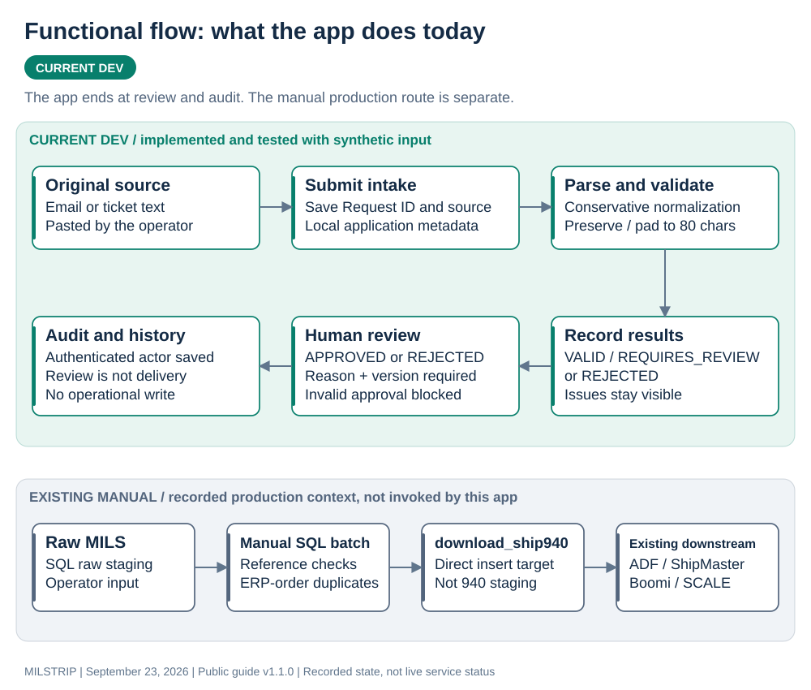
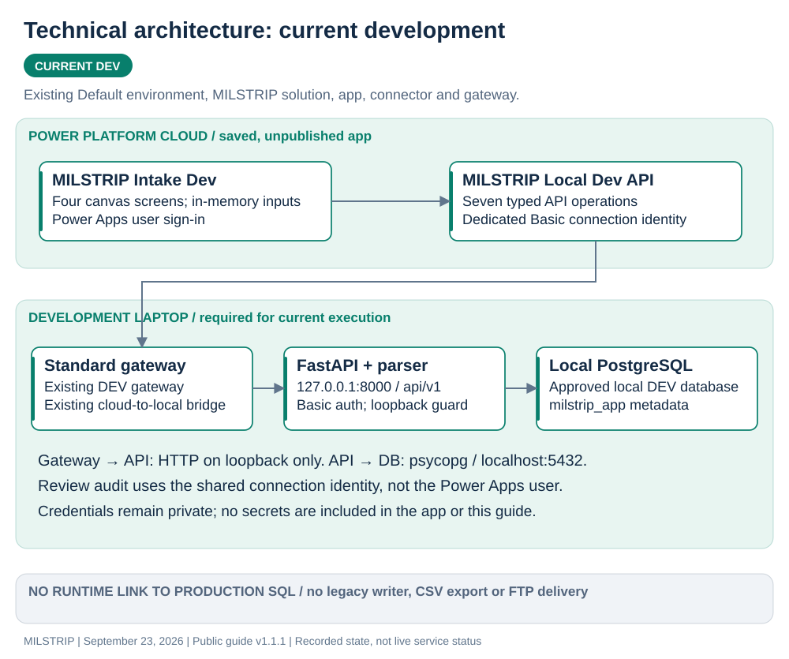
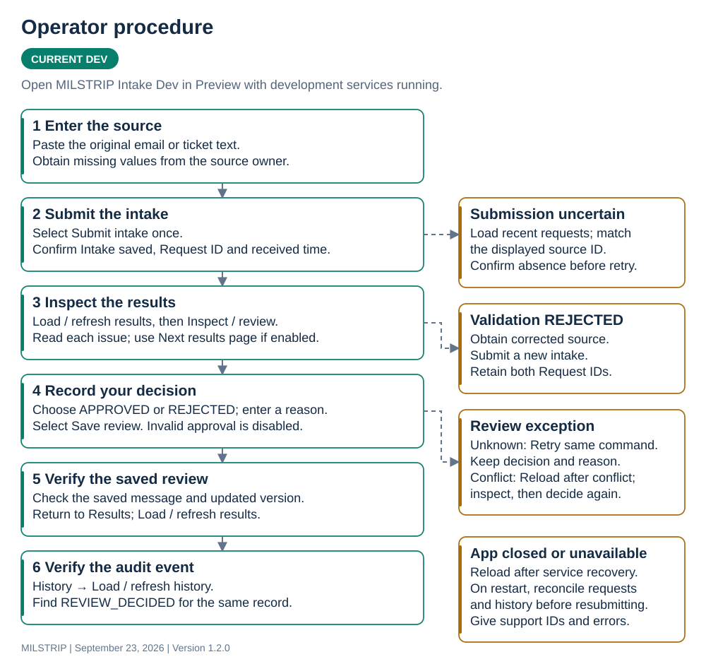
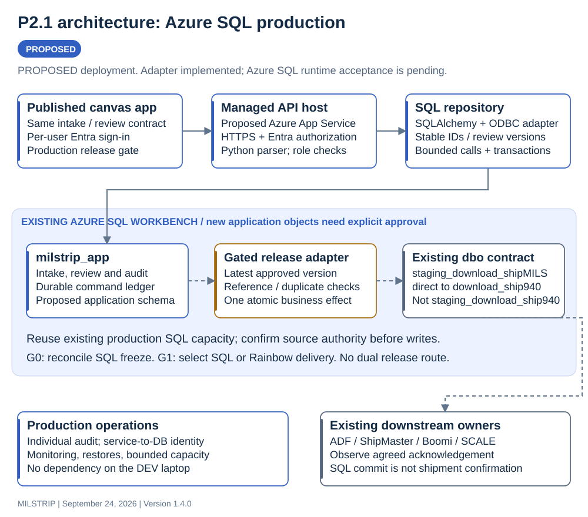
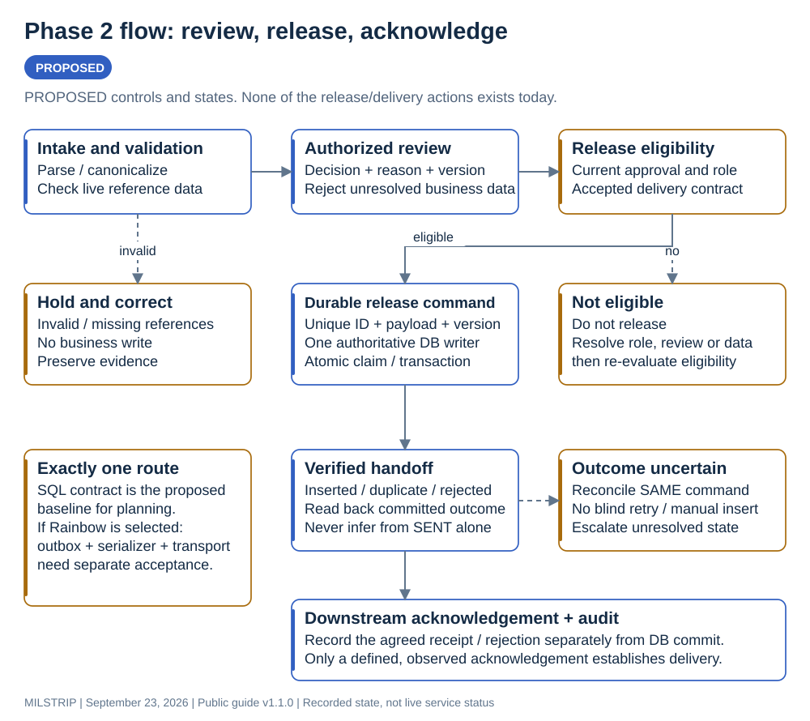
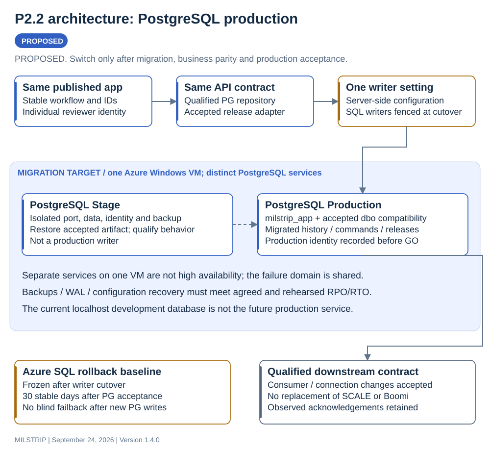
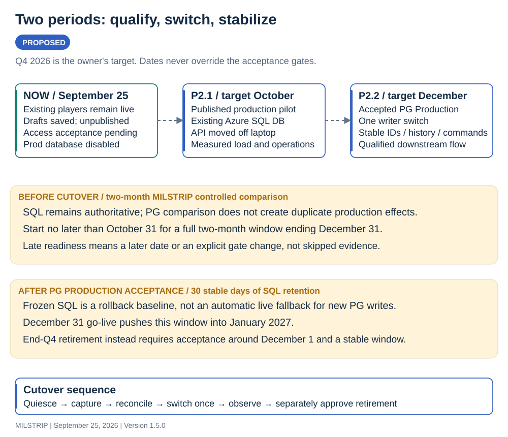

# MILSTRIP: current operation and Phase 2

**Status date: September 23, 2026 | Internal working document | Version 1.0**

This guide separates the **implemented development app**, the **existing manual production process**, and the **proposed published production app**. “Current” describes recorded implementation evidence as of the status date; it is not a new live production inspection. Phase 2 assumes publication has occurred. It does not claim that the current draft is published.

## 1. What exists today

| Area | Current, evidenced state | Limit |
|---|---|---|
| Canvas app | MILSTRIP Intake Dev; intake, results, review and history screens; original icon; saved in the existing MILSTRIP solution | Saved **unpublished** development draft |
| API and connector | Seven authenticated operations; existing MILSTRIP Local Dev API connector and MILSTRIP-DEV-LAPTOP gateway | API runs on Ed's laptop; gateway, API, PostgreSQL and laptop availability are required |
| Persistence | Local PostgreSQL, `trav3pl-psqldb-stage`, application schema `milstrip_app` | Local development state, not production shipment ownership |
| Functional evidence | Synthetic intake, request listing/details, valid/rejected records, approval, invalid-approval guard and audit history passed through the gateway | Synthetic rows were removed after verification |
| Error handling | A 401 exercise preserved input and blocked blind resubmission; backend tests cover retries, conflicts and pagination | Canvas concurrency, outage recovery and multi-page acceptance remain pending |
| Identity | Audit actor is the dedicated Basic connection identity `milstrip-app` | Signing into Power Apps does **not** make the API audit actor the individual user |
| Operational delivery | No current app release, shipment insertion, CSV export or FTP action | **APPROVED means reviewed, not sent or shipped** |
| Manual production | Shawn's recovered raw-MILS SQL workflow uses the existing Azure SQL workbench | The manual process remains a separate operational path |

App ID: `7f1b64d0-d51a-4ec8-84ad-2b18fe8c2f82`. The existing organization Default environment, solution, connector and gateway were reused. A functional `.msapp` backup was verified; it precedes icon selection and solution association. Current screen sources are in `powerapps/canvas/`.

**Acceptance still open:** accessibility/layout refinement, canvas conflict/retry/outage tests, multi-page navigation, shared-user authorization and production release review. No new independent Audit or production release is claimed.

The diagrams use explicit status labels as well as color: **CURRENT DEV**, **EXISTING MANUAL**, **PROPOSED**, and **GATE**. Solid arrows describe the flow inside the stated scenario. Dashed arrows identify conditional future work; they are not implemented integrations.

## 2. Functional flow — current

The parser extracts candidates from pasted text, performs conservative normalization and validation, and preserves accepted positions while right-padding eligible output to exactly 80 characters. It does not invent missing business values. Intake/request status is distinct from each record's validation status and from its human review decision: a mixed request can be REJECTED while containing a valid record.

The app stores original intake and parsed evidence in its local application tables. Review does not change the validation result, rewrite the original record, resolve stock/address reference data against production or authorize delivery. Corrected business input is a new intake; it is not an edit of the read-only canonical field.

**Existing manual production path:** Shawn prepares raw 80-character lines, inserts them into `dbo.staging_download_shipMILS`, then runs the recovered manual batch. That batch performs reference/duplicate checks and inserts directly into `dbo.download_ship940`. It does **not** route this MILSTRIP path through `dbo.staging_download_ship940`. The downstream ADF / ShipMaster / Boomi / SCALE route is recorded discovery context, not newly tested by this app increment. [E2, E3]

## 3. Technical architecture — current

| Component | Responsibility and actual boundary |
|---|---|
| Power Apps | User interface, in-memory pending commands and cursor navigation; contains no SQL and owns no DB credential |
| Custom connector | Typed API contract; GetHealth, CreateIntakeRequest, ListIntakeRequests, GetIntakeRequest, ListRecordResults, CreateReviewDecision, ListAuditEvents |
| Standard gateway | Existing bridge to the laptop; configured API destination is `http://127.0.0.1:8000/api/v1` |
| FastAPI / Python parser | Dedicated Basic authentication, local boundary enforcement, deterministic parsing, review concurrency/idempotency and request-scoped audit |
| PostgreSQL driver | `psycopg`; SQL uses PostgreSQL-specific JSON, locking and result syntax |
| Application tables | `intake_request`, `milstrip_record`, `validation_issue`, `review_decision`, `audit_event` in `milstrip_app` |
| Local legacy mapper | Read-only mapping / controlled temporary-table test evidence; no enabled operational writer |
| Credential storage | Git-ignored restricted `.cred/`; API verifier and owner-provided private credential text; no secrets in this guide |

The runtime deliberately rejects non-loopback peers and a database outside the approved local target. Publishing the canvas app would not remove these restrictions, host the API, add individual-user authorization or create an Azure SQL adapter. Moving to production requires a separately implemented deployment/authentication profile; simply changing a connection string will fail. [E1, E4]

## 4. End-user SOP — current development app

**Audience:** Ed and an explicitly authorized tester. This is the current canvas procedure, not the older CLI-only SOP. Do not distribute the draft as a shared production tool.

**Before starting:** ask the app owner to confirm the laptop API, database and gateway are available. Use approved test input. Open the existing MILSTRIP Intake Dev app in Studio and select Preview. The app starts on Intake. If a published link is later supplied, confirm its environment and release with the owner; publication alone does not change this SOP into a shipment-delivery procedure.

| Step | What you do in the current UI | What to check |
|---|---|---|
| 1. Enter input | On **MILSTRIP intake**, paste the original email or ticket text into the large input box | Preserve the original source. Do not guess missing codes, quantities or addresses |
| 2. Submit once | Select **Submit intake** | Wait for the results screen and a Request ID. Submission is not delivery |
| 3. Load results | Select **Load / refresh results** | Check every record's validation status and issues; use **Next results page** when enabled |
| 4. Inspect a record | Select **Inspect / review** beside that record | Read the issues and canonical length. The canonical field is read-only; accepted output should be 80 characters |
| 5. Record a decision | Choose **APPROVED** or **REJECTED**, enter a reason of 1–1,000 characters, select **Save review** | Approval is blocked for validation-REJECTED records. Resolve review warnings using authoritative information; do not approve uncertainty away |
| 6. Verify the result | Check the saved message and updated review version; use **Results** to return | Refresh results before relying on their displayed review status; an earlier gallery row may be stale |
| 7. Check history | Select **History**, then **Load / refresh history**; use **More history** when enabled | Confirm the record/event and decision. In this development setup, the actor is `milstrip-app`, not your individual name |
| 8. Finish | Keep the Request ID and follow the existing authorized business process separately | There is no Send, Release, CSV or FTP button in the current app |

### Exceptions: preserve evidence before retrying

| What you see | Current action | Do not do |
|---|---|---|
| Submission outcome unknown | Keep the text and source ID displayed in the message. Select **Load recent requests**, then **More requests** if needed. Look for that source ID. If found, open that request. If absent, have the owner confirm it was not created before using **Allow new submission** | Do not repeatedly press Submit or assume a timeout means nothing was saved |
| Validation REJECTED | Read the issue, obtain corrected source information and submit a new intake. Record the reason/context so support can relate the requests | Do not try to approve a rejected validation result or manually trim/rebuild the canonical string |
| Validation REQUIRES_REVIEW | Examine the specific issue and business evidence; reject/escalate if it cannot be resolved | Do not interpret the existence of an Approve option as proof of business correctness |
| Review outcome unknown | Stay on the record and use **Retry same command** when enabled; the pending decision/reason are retained | Do not generate another decision or change its reason while that command is pending |
| Conflict / another review version | Select **Reload after conflict**, inspect the current version and retained reason, then make a fresh decision if appropriate | Do not blindly overwrite the other review |
| Results or history unavailable | Retry the corresponding load/refresh operation after service recovery. Treat retained rows as potentially stale | Do not use stale display data as confirmation of a successful review |
| Browser closed or app restarted | Use recent requests and history to reconcile the outcome; provide the Request ID to support | In-memory input and pending commands are not durable across restart |

For support, send the Request ID, record number, approximate time and visible error text. Do not send passwords, authorization headers or an unredacted order in a screenshot. Canvas conflict/outage/multi-page instructions describe implemented controls whose full UI acceptance remains open; the underlying API cases have passed standalone tests. [E1, E4]

## 5. Phase 2 — published app, two production periods

**PLANNED, NOT DEPLOYED.** The owner's planning assumption is that the canvas app is published at Phase 2 entry. The first period uses the existing Azure SQL production workbench; the second uses PostgreSQL after the migration project is fully live. The Q4 target is interpreted as **December 31, 2026**, based on this request's date. This is a target and dependency, not evidence that PostgreSQL production is ready.

This guide calls the periods **P2.1 — Azure SQL production** and **P2.2 — PostgreSQL production**. These are not the earlier roadmap's “2A CSV / 2B FTP” or the `psql-migration` project's separate Phase 2 data-transfer work. Earlier plans remain historical context; their unresolved delivery and migration gates are not silently waived.

| Concern | CURRENT DEV | P2.1 — Azure SQL | P2.2 — PostgreSQL |
|---|---|---|---|
| App | Saved unpublished draft | Published, accepted release; per-user access | Same user contract, release version and migration notice |
| API host | Ed's laptop | Proposed managed Azure App Service; approved HTTPS ingress | Same API service; change the persistence adapter after qualification |
| App metadata | Local `milstrip_app` PostgreSQL | Proposed application-owned `milstrip_app` schema in the existing Azure SQL DB, subject to DBA gate | `milstrip_app` in accepted production PostgreSQL; migrate durable history and pending commands |
| Business authority | Existing Azure SQL/manual process; app has no delivery authority | Existing Azure SQL workbench remains the single production writer target | PostgreSQL becomes the writer target only after cutover acceptance |
| Connection identity | Shared dedicated Basic development identity | Proposed Entra per-user API identity and least-privilege service-to-DB identity | Same individual audit identity; separately approved PostgreSQL service identity |
| Release / shipment write | Not implemented | New gated release capability, if the delivery route is approved | Same accepted release contract translated and proven against PostgreSQL |
| Laptop gateway | Required for current testing | Development gateway retained for DEV; proposed production HTTPS route removes laptop dependency | Production route retained, qualified against PostgreSQL network access |
| Rollback | Local draft/source backup | Prior compatible app/API release; halt release and reconcile uncertain writes | SQL rollback needs data reconciliation; never route new PG writes back blindly |

**Proposed cost path:** Ruta B for the production API: managed Azure App Service avoids keeping a user's laptop as a production service. Reuse the existing Azure SQL capacity initially; measure incremental load before changing its tier. P2.2 follows the migration project's existing Windows-VM PostgreSQL plan rather than assuming a new managed PostgreSQL purchase. This reduces redesign but transfers OS/database backup, patching and recovery work to the existing owners. No pricing or capacity commitment is made here.

### Source authority and the freeze conflict

The last recorded MILSTRIP read-only SQL review identifies server `trav3pl-sql-eastus.database.windows.net`, database `trav3pl-sqldb-eastus-prod`, on September 21. That is the proposed P2.1 target identity, not a fresh connection test. [E2]

The migration master dated September 3 reports `PHASE_2_FINAL_LOCAL_CANDIDATE_PASS_HOC_ACCEPTANCE_PENDING` and says Azure SQL remains frozen pending acceptance. Later MILSTRIP evidence and the owner's current request describe SQL as the operational source. These records do not prove that the migration freeze was released. **G0:** Ed must reconcile the actual freeze/ownership status before any P2.1 schema change or business write. No production database was queried or changed to prepare this guide. [E5]

If Azure SQL resumes or continues writes for P2.1, the September 3 local migration candidate cannot automatically remain the final authoritative dataset. The migration owner must create a new accepted cutoff/snapshot, or approve and prove a lossless delta method. The migration inventory records 32 keyless tables, so generic incremental synchronization is not assumed safe. The newly introduced application metadata, audit, release ledger, roles and sequences must be added explicitly to the migration manifest; they are not covered merely because the original 77 tables were reconciled. [E5, E6]

## 6. P2.1 architecture — use the existing Azure SQL workbench

**Recommendation:** retain the canvas/API business contract and the pure Python parser. Introduce a persistence interface for intake, results, review, audit and release commands; implement a SQL Server repository and an independently gated legacy-release adapter. Keep the existing PostgreSQL implementation as the DEV adapter and future P2.2 implementation baseline.

The present API uses `psycopg`, `RETURNING`, JSONB casts and `FOR UPDATE`; the Azure SQL version requires explicit T-SQL migrations, types, parameterization and concurrency semantics. Prefer tested unique constraints and an atomic expected-version update/transaction appropriate to SQL Server. Do not mechanically translate PostgreSQL locks or assume `rowversion` is the same as the application's integer review version.

| Work package | Required implementation | Exit evidence |
|---|---|---|
| Identity and hosting | Entra-authenticated API; tenant/audience validation; operator/reviewer/support roles; individual audit actor; approved network ingress and private DB path | Two-user authorization tests, denied unauthorized actions, TLS and service recovery checks |
| SQL persistence | App-owned schema migrations; stable UUID request/command IDs; Unicode source text; exact canonical characters; UTC timestamps; JSON handling; review versions | Same API acceptance suite against SQL and PG adapters; no silent truncation, collation or trailing-space drift |
| Current app completion | Accessibility/layout, multi-page results, outage and conflict UI tests; reliable production configuration and connection references | Shawn/authorized-user UAT; reproducible solution/package and rollback release |
| Live reference validation | Query authoritative ItemMaster / DODAAC references through a narrow API role; explicit stock, quantity, address and eligibility outcomes | Golden cases for missing NSN/DODAAC, A5E address exceptions, duplicate ERP orders and price/unit mappings |
| Controlled release | New release authorization, durable command ledger, transaction boundary and post-commit reconciliation | Retry produces one business effect; two workers cannot release the same eligible version twice |
| Operations | Health/readiness, correlation IDs, audit retention, alert owner, deployment/restore runbook, workload limits | Operator drill, backup/restore evidence, approved capacity baseline and alert routing |

Microsoft documents Entra authentication for custom connectors and managed identities for App Service database access. These are proposed production building blocks, not features of the present Basic/gateway configuration. The OAuth connector and production network route require a tenant proof-of-concept; do not assume the current gateway Basic connection can simply be switched to OAuth. [T1, T2]

### Delivery contract: one selected route

The recovered manual SQL boundary is the strongest concrete integration evidence: preserve raw intake in `dbo.staging_download_shipMILS`, then map into `dbo.download_ship940`. This is the **proposed baseline for estimating a SQL legacy adapter**, not permission to execute the recovered manual script unchanged. Do not use the unrelated `staging_download_ship940` path. [E2]

ADR 0003 separately identifies a future Rainbow CSV/FTP boundary, with no accepted file/protocol/acknowledgement contract. The owner's new database-period plan does not itself choose between that delivery route and a new SQL legacy writer. **G1:** record one accepted delivery contract before release implementation. If Rainbow is selected, keep the application metadata/identity/database-period design but replace the proposed SQL business writer with an outbox/serializer/transport adapter; define CSV, protocol, duplicate and acknowledgement rules first. Do not operate both release paths for the same order. [E7]

The manual script's `SENT` flag can be set after a zero-row insert. Production design must separate actual outcomes such as INSERTED, SKIPPED_DUPLICATE and reference rejection from the compatibility field. A SQL commit proves database handoff, not downstream receipt or shipment. Downstream acknowledgement must be contractually defined and observed before reporting delivery success.

**Transaction proposal for the SQL route:** in the single authoritative production DB, validate current approval/version and references, claim a unique release command, write the raw-MILS/business rows and app ledger/audit together, then commit. Protect ERP-order duplicate semantics against concurrency with an approved uniqueness/locking strategy. Use the record/review version plus command ID to reject changed-payload retries. If an external file/network delivery is chosen, use an outbox and reconciled acknowledgement instead of pretending a DB transaction includes a remote transfer.

## 7. Phase 2 functional flow and future operator delta

The existing intake/review/history procedure stays recognizable. A **proposed** production release screen adds eligibility, live-reference results, release permission, durable outcome and downstream acknowledgement. None of those new controls exists today.

1. Open the owner-provided **published** app and verify the environment/release banner.
2. Paste and submit once; review validation and live-reference issues.
3. An authorized reviewer approves or rejects with a reason. Approval alone still does not send anything.
4. If the accepted release policy permits it, an authorized operator selects the future release action against the latest approved version. Exact UI label and separation-of-duties policy are pending G1/G2.
5. If the outcome is uncertain, reconcile the same durable release command. Do not create a new release or fall back to a manual SQL insert until support confirms the first outcome.
6. Read the committed handoff result and, separately, the downstream acknowledgement. Escalate rejects/duplicates with IDs; never represent a timeout or legacy SENT flag as proof of shipment.

## 8. P2.2 architecture — move to PostgreSQL when fully live

The migration repository's target is **one Azure Windows Server VM with separate Stage and Production PostgreSQL clusters/services**. Keep their ports, identities, data directories, logs and backup policies separate. This is environment isolation, not high availability: a VM failure can affect both. The current localhost `trav3pl-psqldb-stage` is not that future production service, and the future production hostname/database identity must be recorded before deployment. [E5]

| Portability boundary | P2.2 requirement |
|---|---|
| API and app | Keep DTOs, record IDs, review/command versions and operator meaning stable; use a release-configured backend, never let users choose a DB |
| Persistence | Translate SQL types, JSON, Unicode, timestamps, identities/sequences, indexes, locking and duplicate semantics explicitly; test the same behavior suite |
| Historical state | Migrate approved application records, reviews, actor IDs, audit events, pending commands, release ledger and acknowledgements; reconcile every in-scope entity and relationship |
| Operational objects | Use accepted lower-case `dbo` compatibility objects and the proven MILS-to-940 contract; current local mapper tests do not constitute PG production acceptance |
| Identity and access | Retain individual user audit identity at the API; separate app runtime, migration and support DB roles; approved secret storage if the service identity requires a secret |
| Protection and recovery | Exact accepted deployment artifact; independent Stage/Prod recovery tests; monitored backup/WAL strategy for the required RPO; retain required configuration backups |
| Downstream dependencies | Qualify the approved ADF/export/consumer connection change and acknowledgements; migration of the workbench alone does not migrate SCALE or Boomi |

PostgreSQL documents base backups plus archived WAL for point-in-time recovery. An accepted logical dump is a promotion artifact; it is not by itself a continuous-archiving/PITR solution. The database owner must select and rehearse the recovery method that meets the agreed RPO/RTO. [T3]

### Two-month qualification and the Q4 dependency

The MILSTRIP roadmap calls for a two-month controlled dry run while SQL remains authoritative. The migration project separately requires **30 stable calendar days with SQL frozen after PostgreSQL Production acceptance** before decommission approval. These are different clocks: the 30-day rollback window does not replace the pre-cutover dry run. [E5, E8]

A workable **proposed** schedule is preparation during the remainder of September, P2.1 pilot and qualification start in October, two-month comparison through November, and a gated P2.2 cutover in December. A complete two-month qualification for a December 31 target must start no later than October 31; readiness slippage moves the date unless Ed explicitly revises the accepted gate. The target does not justify skipping parity, restore or operator acceptance.

If PostgreSQL becomes fully live only on December 31, the 30-day stabilization/SQL retention period extends into January 2027. If “migration completed by end of Q4” includes SQL retirement, PostgreSQL Production acceptance needs to occur by approximately December 1 with no reset of that stability window. This scheduling distinction must be agreed with the migration owner; do not promise both without the required lead time.

## 9. Capacity, cutover and rollback

### Scale by measured load

These two periods describe platform maturity, not invented user-count guarantees. Existing table counts do not establish the new app's capacity. Capture operator concurrency, peak records per batch, requests/minute, P95 API latency, lock waits, command backlog, database CPU/IO, storage growth and downstream acknowledgement latency.

| Period | Initial operating model | Scale trigger and response |
|---|---|---|
| P2.1 | Bounded pilot on existing SQL capacity, stateless API, DB-owned review/release state; no personal laptop dependency | Load-test at twice the measured expected peak (proposed acceptance target). If limits breach the agreed SLO, first bound batch size, pool size and queries; then evaluate API instances/SQL tier with measured cost. All instances use the same command ledger |
| P2.2 | Qualified PG production service and unchanged API contract; controlled single-writer ownership | Re-run the load suite on PG. Tune indexes/pools/autovacuum from observed evidence; separate Stage/Prod compute or add HA only when availability/capacity requirements justify it. Read replicas must not serve stale release eligibility |

Proposed starting acceptance targets for owner review: no duplicate business release under concurrent retries; no loss of an acknowledged committed command; P95 interactive reads at or below 2 seconds under the agreed test load. Availability, maximum batch size, release latency, acknowledgement timeout, RPO and RTO require actual workload/downstream/IT agreement. They are not current service guarantees. Add a queue/worker only if measured operation duration makes synchronous execution unreliable; preserve durable idempotency either way.

### Cutover runbook (plan only)

1. **Baseline:** record app/API versions, schema/manifest hashes, identities, source authority, command ownership and the rollback artifact. Resolve G0/G1/G2 first.
2. **Rehearse:** prove SQL/PG behavior, every in-scope data relationship, reference mappings, duplicate rules and downstream outcomes. Qualify the same release on Stage; complete backup/restore and operator drills.
3. **Quiesce:** stop new submissions/releases and the manual SQL batch under one announced writer barrier. Reconcile pending and unknown commands; do not rely on a UI maintenance message alone to stop service identities or jobs.
4. **Capture and migrate:** establish the new accepted cutoff. Follow the migration project's approved snapshot/load/reconciliation mechanics, expanded for all new app objects. Preserve IDs, UTC event order, command payload hashes, review versions and sequence high-water marks. A resumed SQL source requires a fresh accepted capture.
5. **Validate:** compare counts and deterministic content fingerprints for approved in-scope data, validate constraints/sequences, recheck reference/handoff behavior and identify every unresolved command. No raw source rows enter Git.
6. **Switch once:** change the approved server-side repository/connection and downstream configuration; fence old SQL writers. Only one system may create production business effects. Run the controlled production smoke test and obtain acceptance.
7. **Observe:** monitor production, retain frozen SQL for the agreed 30-day window and preserve independent backups. Do not decommission from a calendar reminder alone.

**Before the first PostgreSQL production write:** rollback can return to the frozen SQL baseline after validation and ownership restoration. **After PostgreSQL writes:** stop both release paths and reconcile/replay accepted PG-era changes through an approved recovery plan, or restore/repair PostgreSQL. Switching the connection string back to stale SQL loses state and risks duplicate orders. Without a proven reverse reconciliation procedure, prefer forward recovery and keep the service paused. No automatic dual write or automatic fallback is proposed.

## 10. Delivery backlog and release gates

| Gate / work | Responsible role | Required result |
|---|---|---|
| G0 — authority and freeze | Ed + migration owner | Confirm actual SQL state, permitted source writes, baseline freshness and impact on migration manifests |
| G1 — business release contract | Ed + Shawn + downstream owner | Select SQL or Rainbow route; define eligibility, A5E/reference exceptions, duplicates and delivery acknowledgement |
| G2 — production design | Ed + IT/security | Approve API hosting/network, Entra roles, DB identities, recovery SLOs, environment/release configuration and operational ownership |
| Build P2.1 | Implementer | Persistence seam, SQL migrations/adapter, per-user auth, live reference checks, gated release ledger/adapter, completed canvas UX |
| G3 — P2.1 acceptance | Independent reviewer + Ed + Shawn | API/UI failure-path suite, SQL parity, concurrency/retry/restore evidence and bounded pilot acceptance |
| Qualify P2.2 | MILSTRIP and migration implementers | Full data/object scope refresh, two-month comparison, PG adapters, load/restore tests and Stage acceptance |
| G4 — writer cutover | Ed + migration/downstream owners | Approved cutoff, reconciled pending commands/data, one authoritative writer, accepted production smoke test |
| G5 — stabilize and retire | Ed + IT + business owner | Stable retention window, retained evidence/recovery position and separate SQL decommission decision |

No person must manually paste formulas to implement this plan. The implementer owns code, repeatable migrations, automated tests and deployment packages. Human actions are confined to business contracts, identity/permission provisioning where needed, operational freeze/cutover decisions, independent acceptance and release authority. This document is a design package, not execution of those production gates.

The immediate next work is to finish current canvas acceptance while G0/G1/G2 are resolved; then build the Azure SQL adapter against a non-production target. PostgreSQL rehearsal can proceed in parallel as project work, but production ownership remains singular. Preserve the existing solution/app lineage; release through approved environment-specific connection references rather than mutating the development gateway into production.

## 11. Evidence and document precedence

| Ref | Source | What it supports |
|---|---|---|
| E1 | [Canvas implementation evidence](../delivery/CANVAS_IMPLEMENTATION_2026-09-23.md) | September 23 saved state, live synthetic UI checks, connection fix, solution membership and remaining tests |
| E2 | [Legacy flow review](../MILSTRIP_LEGACY_FLOW_REVIEW.md) | September 21 SQL identity, recovered manual path, reference/duplicate rules and misleading SENT behavior |
| E3 | [Historical architecture](../ARCHITECTURE.md) | Discovery description of ADF, ShipMaster, Boomi and SCALE; no new end-to-end validation |
| E4 | [Canvas sources](../../powerapps/canvas/README.md), [operator API contract](../OPERATOR_API_CONTRACT.md), `api/auth.py`, `api/database.py`, `api/operator.py` | Actual controls, identities, statuses, loopback enforcement and PostgreSQL coupling |
| E5 | Sibling `psql-migration/docs/master.md`, last updated September 3, 2026 | Final local candidate only, freeze/acceptance gate, Windows VM Stage/Prod architecture, 30-day retention |
| E6 | Sibling `psql-migration/docs/architecture/adr/0010-sequential-csv-copy-phase-2-transfer.md` | Accepted sequential snapshot/CSV/COPY method and keyless-table limitation |
| E7 | [ADR 0003](../adr/0003-rainbow-csv-ftp-is-the-delivery-boundary.md) | Earlier Rainbow route and missing output/transport contracts |
| E8 | [PostgreSQL intelligence roadmap](../PSQL_INTELLIGENCE_ROADMAP.md) | Two-month controlled qualification and protected SQL ownership |
| T1 | [Microsoft: connector/API Entra authentication](https://learn.microsoft.com/en-us/connectors/custom-connectors/azure-active-directory-authentication) | Production authentication design reference; not a statement about the current connector |
| T2 | [Microsoft: App Service managed identity and databases](https://learn.microsoft.com/en-us/azure/app-service/tutorial-connect-msi-azure-database) | Proposed managed API-to-database identity building block |
| T3 | [PostgreSQL 18: continuous archiving/PITR](https://www.postgresql.org/docs/18/continuous-archiving.html) | Distinction between a promotion dump and operational point-in-time recovery |

Sibling repository evidence was read locally for this plan; its operational claims may have changed after the document dates. No credentials, raw production orders, database access, tenant configuration change, production deployment, commit or push was needed to create this package. The author checked consistency and rendering; this is not an independent production Audit.
