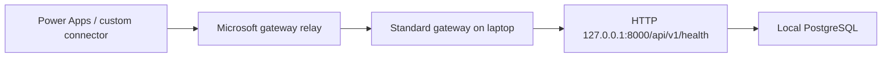

# PowerApps setup

**Date:** 2026-09-23. **Scope:** successful development setup through a tested
Power Apps custom connector calling the API on the owner's laptop.

This procedure records the working configuration only. It does not include
failed attempts. Existing resources should be reused when resuming this project.

## 1. Understand where each component runs

| Component | Location / actual configuration |
| --- | --- |
| Power Apps canvas editor, solution and connector | Organization's existing Default environment |
| Solution | MILSTRIP, unmanaged; existing TAB publisher |
| Custom connector | MILSTRIP Local Dev API |
| Standard gateway | MILSTRIP-DEV-LAPTOP, installed on the laptop |
| Gateway region shown for Power Apps / Power Automate | Central US |
| API endpoint | HTTP, `127.0.0.1:8000`, base `/api/v1` |
| PostgreSQL | Laptop, `localhost:5432`, database `trav3pl-psqldb-stage` |
| Application schema | `milstrip_app` |
| Connector authentication declaration | Basic authentication |
| Confirmed connector operation | GetHealth |



The work account signs in to Microsoft services and registers the gateway.
Basic authentication represents a separate API credential. The successful
health-only test did not validate that credential: API authentication enforcement
is the next implementation step. Power Apps hosts the UI; deployment will also
need an API host and a database host. The backend stays local during this phase.

## 2. Open the canvas editor

1. Sign in to the organization's Microsoft 365 portal with the work account.
2. Open Power Apps from the application launcher.
3. Create an app using the blank canvas template.
4. Keep the existing organization environment shown in the top bar.
5. Save the draft using the toolbar Save icon. The instructed name was
   `MILSTRIP Intake Dev`; verify the saved app name and ID when resuming.
6. Return to the maker portal with Back.

The blank canvas screen was observed in this session. Its final saved name,
solution membership and publication status were not independently verified.

## 3. Create the solution

1. Select **Solutions** from the maker portal's left navigation.
2. Select **New solution**.
3. Enter the following values, then select Create or Save:

| Field | Value instructed in the session |
| --- | --- |
| Display name | MILSTRIP |
| Name | MILSTRIP |
| Publisher | Existing TAB publisher |
| Version | 0.1.0.0 |
| Set as preferred solution | Leave unchecked |

4. Open MILSTRIP. The owner confirmed creation and showed its empty object list.
5. Select **New → Automation → Custom connector**. The connector editor opens
   in Power Automate; this is the expected transition from the solution.

This route follows [Microsoft's solution connector procedure](https://learn.microsoft.com/en-us/connectors/custom-connectors/customconnectorssolutions).

## 4. Configure General

Set the connector name at the top to **MILSTRIP Local Dev API**. On **1. General**:

| Field | Successful setting |
| --- | --- |
| Description | MILSTRIP development API running on Ed's laptop. |
| Connect via on-premises data gateway | Checked |
| Scheme | HTTP |
| Host | `127.0.0.1:8000` |
| Base URL | `/api/v1` |
| Connector icon / background | Default values were retained |

The gateway and API must run on the same laptop for this loopback address.
The Host field contains only the address and port. The scheme and path have
their own fields. These values are confirmed by the exported Swagger file.

## 5. Configure Security

1. Select **2. Security**.
2. Choose **Basic authentication**.
3. Keep the parameter labels `username` and `password`.

These are display labels, not credential values. The actual values are entered
privately in the connection form later. No new Entra application registration
was created in this session. No API username/password is recorded in this SOP.

## 6. Define the GetHealth action

1. Select **3. Definition → New action**.
2. Set:

| Field | Value |
| --- | --- |
| Summary | Check API health |
| Description | Check whether the local API and database are available. |
| Operation ID | GetHealth |

3. Under Request, select **Import from sample**.
4. Select **GET** and enter `http://127.0.0.1:8000/api/v1/health`.
5. Leave the request body and headers empty, then select Import.
6. Under Response, select **Add default response** and import this body:

```json
{
  "status": "OK",
  "database": "AVAILABLE"
}
```

7. Keep both response properties as strings. No request parameters are needed.
8. Leave triggers empty.
9. On **4. Code**, leave **Code Disabled**.
10. Select **Create connector**. For later edits, select **Update connector**.

The resulting export defines `GET /health` relative to `/api/v1`. The operation
is configured through the [Microsoft custom connector wizard](https://learn.microsoft.com/en-us/connectors/custom-connectors/define-blank).

## 7. Install and register the laptop gateway

1. On the laptop hosting the API and database, open Microsoft's
   [standard gateway installation page](https://learn.microsoft.com/en-us/data-integration/gateway/service-gateway-install).
2. Download and install the standard gateway using the default installation path.
3. Sign in with the same organization work account used for Power Apps.
4. Select **Register a new gateway on this computer**.
5. Enter **MILSTRIP-DEV-LAPTOP** as the gateway name.
6. Create a recovery key and retain it privately.
7. Use the region corresponding to the Power Apps environment; the completed
   registration in this session showed **Central US**.
8. Complete registration. Verify Status shows the gateway online and
   **Power Apps, Power Automate: Ready**.
9. Close the configuration window. The gateway runs as a Windows service.

The observed version was `3000.334.4 (September 2026)`. Keep the laptop awake
and connected while developing. The Windows service name is `PBIEgwService`.

## 8. Start the health-only development endpoint

For this session's connectivity milestone, the agent ran a temporary FastAPI
process exposing only health. It reused the existing database health function;
it did not expose intake, review or history routes. To reproduce that milestone,
run the following from the repository root in PowerShell:

```powershell
# Use the existing local PostgreSQL authentication setup; do not paste passwords.
if (-not $env:MILSTRIP_DATABASE_URL) {
    $env:MILSTRIP_DATABASE_URL = 'postgresql://TabAdmin@localhost:5432/trav3pl-psqldb-stage'
}
@'
from fastapi import FastAPI
from api.app import health
import uvicorn

probe = FastAPI()
probe.add_api_route('/api/v1/health', health, methods=['GET'])
uvicorn.run(probe, host='127.0.0.1', port=8000, proxy_headers=False)
'@ | .\.venv\Scripts\python.exe -
```

This command assumes the repository virtual environment, local migrations and
database access already established earlier in the project. Use the existing
process if it is already listening on port 8000. Keep its terminal open.

In a second PowerShell terminal:

```powershell
Invoke-RestMethod 'http://127.0.0.1:8000/api/v1/health'
```

The session's local check returned `status: OK` and `database: AVAILABLE`.
This process is temporary; verify it again after restarting a session or laptop.

## 9. Create the gateway connection and test

1. Return to the connector's **5. Test** tab.
2. Select **New connection**.
3. Enter the dedicated development API credential privately, select authentication
   type **basic**, and select gateway **MILSTRIP-DEV-LAPTOP**.
4. Select **Create connection**.
5. Return to Test, refresh the connection list and select the saved connection.
6. Select **GetHealth → Test operation**.
7. Confirm a green success indicator and response status **200**. The owner
   supplied a screenshot confirming both.

The credential values used for this connection are not known to the repository.
The health-only endpoint accepts the request without validating them. This
milestone establishes the network path, not authenticated access to application
data. Once API authentication is implemented, update the saved connection with
the matching credential and test accepted and rejected authentication paths.

## 10. Export and preserve the configuration

1. Close the editor to return to Custom connectors.
2. Locate **MILSTRIP Local Dev API**.
3. Select its download-arrow action and save the Swagger JSON.
4. Store it at
   [powerapps/connectors/MILSTRIP-Local-Dev-API.swagger.json](../powerapps/connectors/MILSTRIP-Local-Dev-API.swagger.json).

The supplied export was moved unchanged and checked by SHA-256. It is OpenAPI
2.0 with Basic authentication and one operation, GetHealth. The runtime backend
schema in `docs/operator-api.openapi.json` is a separate OpenAPI 3.1 reference.
Gateway selection and saved credentials are not embedded in the Swagger export.

## 11. App artwork and screenshot evidence

The owner supplied the following app icon. Its unchanged original is saved at
[assets/milstrip-app.png](../assets/milstrip-app.png). Applying it to the canvas
app remains part of app implementation.


Screenshots were supplied in chat for the blank canvas, solution, General,
Security, Definition/Test, disabled Code, gateway Ready state and successful
HTTP 200 test. Their original image files were not available in the repository
or the inspected local download locations. They are not reproduced or fabricated
here. The field tables above transcribe the successful screens; the icon is the
available original image asset. Request-header captures containing authorization
tokens are excluded from publication.

## 12. Handoff and acceptance boundary

Completed: existing environment selected, solution and connector created,
standard gateway registered, GetHealth action configured, gateway HTTP 200
observed, icon stored and connector exported.

Next implementation: authenticate the API, derive the reviewer identity on the
server, add application connector actions, then build the intake/results/review/
history screens. Verify CLI access before promising unattended tenant changes.

Use the [new-session prompt](restart-prompt.md). No operational legacy writes,
production deployment or SQL Server retirement is part of this setup.
